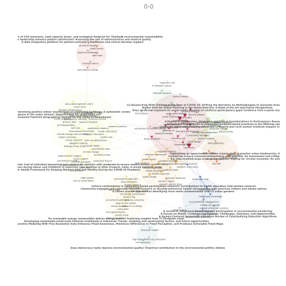

# AI-assisted-literature-review
Workshop series

In this workshop series we introduce tools and websites that can assisst researchers navigating existing literature and visualizing literature reviews.
The aim is to equip researchers with a pipeline of tools and software that can facilitate literature searches, inspire new ways to analyse existing literature, and visualize the literature landscape in specific research areas.
### PDF Step-by-step guide
[Download here]()

# WORKSHOP: Literature Visualizations - Step by step

The first part of the workshop series focused on finding relevant liteature.
In this session we go through a number of tools and open-source software to visualize the literature scapes in different ways.
Visualizations can help to show relations of aspects such as keywords or authors in the literature, or can give an overview over the development of a body of literature on a certain topic.

### tools used in this tutorial: 

[ScienceScape](https://medialab.github.io/sciencescape/)
[Table2Net](https://medialab.github.io/table2net/)
[GephiLite](https://gephi.org/gephi-lite/)
[Cortext](https://managerv2.cortext.net/login)
[TUT](https://tut.man.dtu.dk)

## Step 1 - Download data as a csv file

In this example we use scientific literature from [Scopus](https://www.scopus.com).
When downloading the list of publciations and entities as a csv file, remember the following:

- select all
- export as csv
- include abstracts & keywords

There is a limit to the number of articles that can be downloaded at a time. 
If you wish to include more than the given number in your file, you have to download the results in different steps and merge them into one csv file manually.

## Step 2 - Visualizing in ScienceScape

[ScienceScape](https://medialab.github.io/sciencescape/) works with the csv data from Scopus or alternatively Web of Science and turns them into visualizations. 
There are a number of visualization types to choose from.

## Step 3 - Visualizing in Table2Net

As opposed to ScienceScape, [Table2Net](https://medialab.github.io/table2net/) can work with any type of tabular data. So we are less restricted on the input (does not have to be Scopus or WebofScience).
An example could be interview data, that you have curated into a tabular format; say Speaker and Answer in a spreadsheet as a csv file.

Once you open [Table2Net](https://medialab.github.io/table2net/), you have different options to explore, beginning with the type of network. In our case we choose a normal network (one type of node). 
The nodes can represent a variable of your choosing (e.g. author keywords)
For now, we do not add other attributes.

The links between the nodes refer to row numbers in your table.

We do not add temporal data in this case. But again - all variables are customizable to your preferences.

The difference between the tabular data and the network you produce here, is that the network data has attributes - coordinates etc. 
There are relations between the data points, making it possible to place them in a coordinate system.

Table2Net produces a network file that we are visualizing in Gephi or Gephi Lite.

## Step 4 - Gephi or Gephi Lite

Gephi can be downloaded, [GephiLite](https://gephi.org/gephi-lite/) is the browser version of the program.
In this step you need to think about what you want to see

Once you have uploaded your network file to Gephi and receive the first (probably quite messy and dense) network, you can apply different filters.

1. Choosing a layout

We use the force atlas layout, which uses a force-vector algorithm - a simulated physical force that pulls the nodes together. 
It will keep running to try and optimize the relations between the nodes until they are balanced. It is imposssible to balance perfectly, but
in order to merge all nodes in a 2-dimensional space this is as good as it gets.

2. Turn on the labels
We turn on labels to see what the titles of the nodes are. In our case - visualizing keywords - we see keywords that tend to appear together in papers
and groups of papers where these occur together.

## Step 5 - Cortext

Using [Cortext](https://managerv2.cortext.net/dashboard) requires setting up a free account.

This interface does not require coding by the user, but offers functios that would also be achievable by coding them in python for example.
The open-source platform gives you an interfacce to work with a scrupt of your own data.
You will upload your data and start a script. Cortext will then produce a text analysis and add layers of analysis onto your script.

1. Click "upload file" and upload your text file
2. click "start script"
3. In NLP a dataset is called a corpus, therefore you turn the data into a script by saying "parsing the corpus"
4. click "run script"
5. we now created a database that we can use to do different things with in Cortext.

An example of what you can do here is the extraction of noun phrases (several words in a sequence that refer to a concept or analysis point)
You can see an example of a network created in cortext using noun phrases here:

